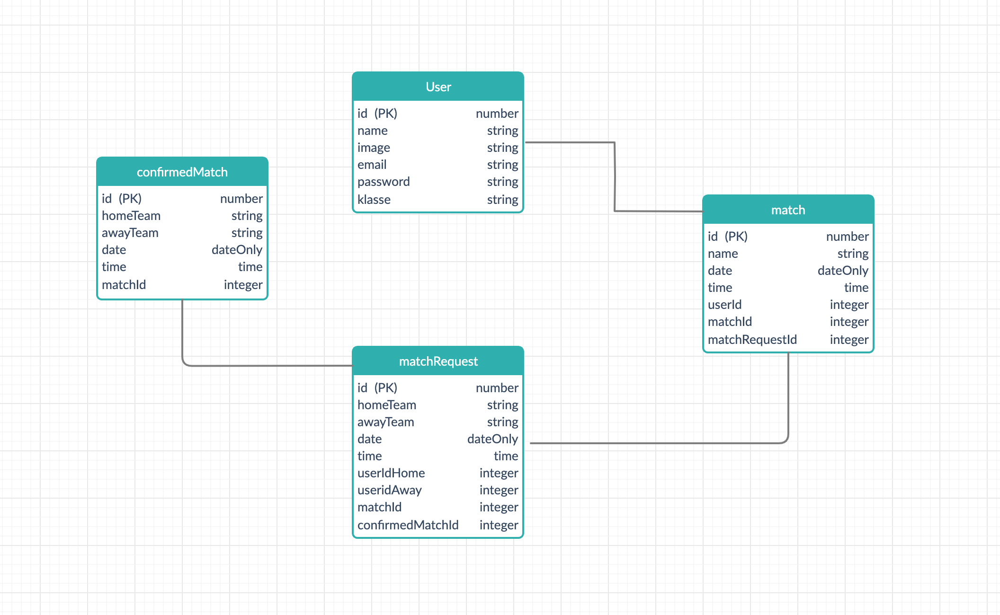

# Friendly Games - SERVER

Friendly Games is an application that allows to create amateur soccer associations to reach each other for friendly Matches.

Built with Node with Express for RestAPIs in the backend, and PostgreSQL with Sequelize and PostGIS for storing location-based user data.

## Table of contents:

- **[Setup](#setup-how-to-use-this-template)**
- **[Endpoints](#endpoints)**
- **[Data Model](#data-model)**
- **[Client side repo](#client-side-repo)**

## SETUP How to use this template

1. Create a new project based on this template using the `Use this template` button
2. Clone the app

```
git clone git@github.com:YOUR_GITHUB_NAME/YOUR_PROJECT_NAME.git
```

3. cd into your project

```
cd YOUR_PROJECT_NAME
```

4. install dependencies

```
npm install
```

5. Configure your database in `config/config.json`

The default assumes a postgres database with

- username: postgres
- password: secret

```json
// config/config.json
{
  "development": {
    "username": "postgres",
    "password": "secret",
    "database": "YOUR_PROJECT_NAME_HERE_development",
    "host": "localhost",
    "dialect": "postgres",
    "operatorsAliases": "0"
  }
}
```

6. Create database, run migrations & seed data

`package.json` contains a script for this

```bash
npm run initdev
```

Or run the commands seperately

```bash
npx sequelize-cli db:create
npx sequelize-cli db:migrate
npx sequelize-cli db:seed:all
```

7. start server with `nodemon` (recommended for development)

```
npm run dev
```

8. or start normally

```
npm start
```

## Data Model



## Endpoints

| Method | Path                       | Purpose                             | required parameters   | auth |
| ------ | -------------------------- | ----------------------------------- | --------------------- | ---- |
| GET    | '/'                        | Test if your server is running      | none                  | no   |
| POST   | '/echo'                    | Test POST requests                  | none                  | no   |
| POST   | '/signup'                  | Create a new user and get a token   | email, name, password | no   |
| POST   | '/login'                   | Get a token with email & password   | email, password       | no   |
| GET    | '/me'                      | Get information of this user        | none                  | yes  |
| POST   | '/authorized_post_request' | Test POST requests (token required) | none                  | yes  |

## Client side repo

The client side of this project is built with React and Redux and styled with CSS3 and Bootsrap.

[Click here](https://github.com/chasin87/Friendly-Game-FE) to view client side repo
